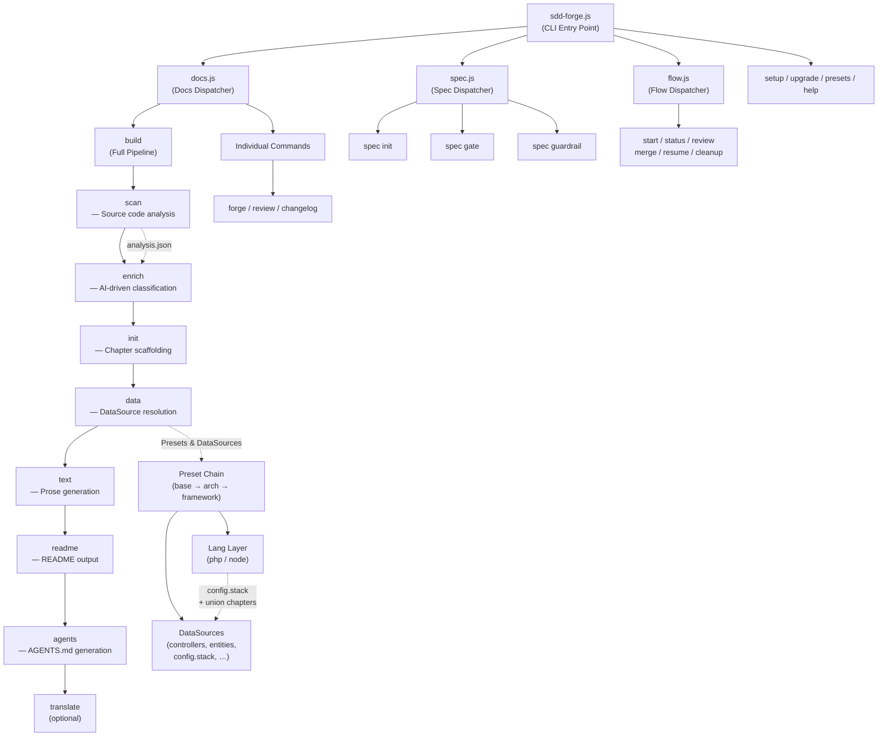

# 01. Tool Overview and Architecture

## Description

<!-- {{text: Write a 1-2 sentence overview of this chapter. Include the tool's purpose, the problem it solves, and its primary use cases.}} -->

This chapter introduces sdd-forge, a CLI tool that automatically generates structured documentation from source code analysis and provides a Spec-Driven Development (SDD) workflow. It covers the tool's architecture, key concepts, and typical usage flow to help users understand how sdd-forge transforms codebases into maintainable, up-to-date project documentation.

<!-- {{/text}} -->

## Content

### Purpose

<!-- {{text: Describe the problem this CLI tool solves and its target users. Derive the purpose from package.json and README.}} -->

sdd-forge addresses the challenge of keeping project documentation accurate and in sync with evolving source code. In many projects, documentation becomes outdated quickly because maintaining it manually is time-consuming and error-prone. sdd-forge solves this by analyzing source code directly and generating structured documentation through a pipeline of automated steps.

The tool targets development teams working on web applications built with frameworks such as Symfony, CakePHP, and Laravel, as well as Node.js CLI tools and libraries. It provides framework-aware analyzers (called DataSources) that understand controllers, entities, models, migrations, and other framework-specific constructs, extracting meaningful information without requiring developers to annotate their code manually.

Beyond documentation generation, sdd-forge also offers a Spec-Driven Development workflow that guides teams through planning, specification, implementation, and review — ensuring that changes are documented as part of the development process rather than as an afterthought.

<!-- {{/text}} -->

### Architecture Overview

<!-- {{text[mode=deep]: Generate a mermaid flowchart showing the tool's overall architecture. Include the dispatch structure from entry point to subcommands and the main processing flow (input → processing → output). Output only the mermaid code block.}} -->



<!-- {{/text}} -->

### Key Concepts

<!-- {{text: Explain the key concepts and terminology needed to understand this tool in table format. Extract the main concepts from source code.}} -->

| Concept | Description |
|---|---|
| **Preset** | A reusable configuration package that defines framework-specific analyzers, chapter order, and templates. Presets form an inheritance chain (e.g., `base` → `webapp` → `symfony`) via the `parent` field. A separate **lang layer** (`php`, `node`) provides language-specific DataSources (e.g., `config.stack`) and chapters that are automatically union-merged into the parent chain. |
| **DataSource** | A class responsible for scanning source files and resolving `{{data}}` directives. Each DataSource implements `match()` to select relevant files, `scan()` to extract structured data, and named methods (e.g., `relations()`, `columns()`) to render that data into markdown tables. |
| **Directive** | A template marker embedded in chapter files. `{{data: source.method("labels")}}` inserts structured data from a DataSource, while `{{text: instruction}}` delegates prose generation to an AI agent. Content outside directives is preserved across regeneration. |
| **Chapter** | A markdown file representing one section of the generated documentation. Chapter order and inclusion are controlled by the `chapters` array in `preset.json` or overridden in `config.json`. |
| **Pipeline** | The sequential processing stages executed by `sdd-forge docs build`: `scan → enrich → init → data → text → readme → agents → [translate]`. Each stage reads the output of the previous stage and produces input for the next. |
| **Enrichment** | An AI-powered stage that takes raw scan results and adds role classification, summaries, and chapter assignments to each file entry, providing the semantic context needed for high-quality text generation. |
| **SDD Flow** | The Spec-Driven Development workflow (`sdd-forge flow`) that orchestrates planning, specification gating, implementation, review, and merge steps, ensuring changes are documented alongside code. |
| **analysis.json** | The intermediate output of the `scan` stage, stored in `.sdd-forge/output/`. It contains the structured representation of the entire codebase that subsequent pipeline stages consume. |

<!-- {{/text}} -->

### Typical Usage Flow

<!-- {{text: Describe the typical steps from installation to first output in step format. Derive the steps from help output and command definitions in the source code.}} -->

1. **Install sdd-forge** — Install the package globally via npm:
   ```
   npm install -g sdd-forge
   ```

2. **Initialize the project** — Run `sdd-forge setup` in your project root. This creates the `.sdd-forge/` directory, generates a `config.json` with project-specific settings (language, framework type, documentation languages), and sets up the preset chain appropriate for your framework.

3. **Run a full documentation build** — Execute `sdd-forge docs build` to run the complete pipeline. This scans your source code, enriches the analysis with AI-generated classifications, scaffolds chapter files, resolves data directives, generates prose for text directives, and produces the final README and AGENTS.md.

4. **Review the output** — Inspect the generated `docs/` directory. Each chapter file contains structured documentation with `{{data}}` and `{{text}}` directives. Content written outside directive blocks is preserved on subsequent builds.

5. **Iterate with individual commands** — After the initial build, you can run individual pipeline stages (e.g., `sdd-forge docs scan`, `sdd-forge docs text`) to regenerate specific parts without re-running the entire pipeline.

6. **Use the SDD workflow for changes** — When adding features or making modifications, start with `sdd-forge flow --request "<description>"` to enter the Spec-Driven Development workflow, which guides you through planning, implementation, and documentation updates in a structured sequence.

<!-- {{/text}} -->
