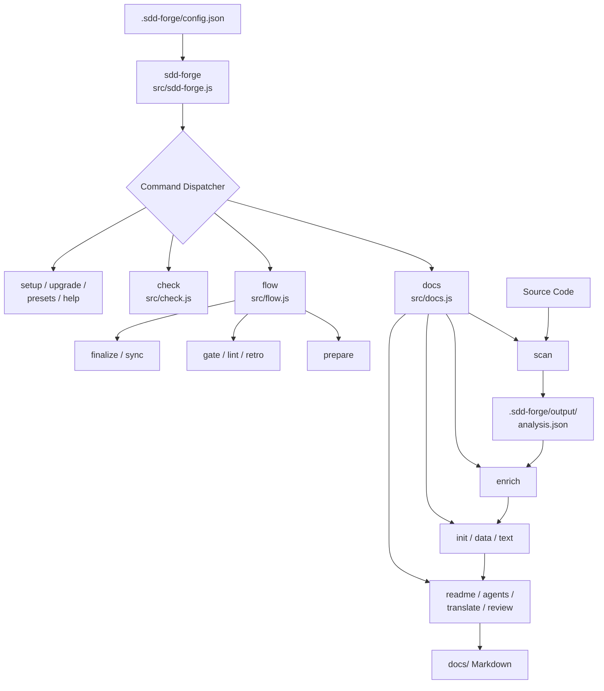
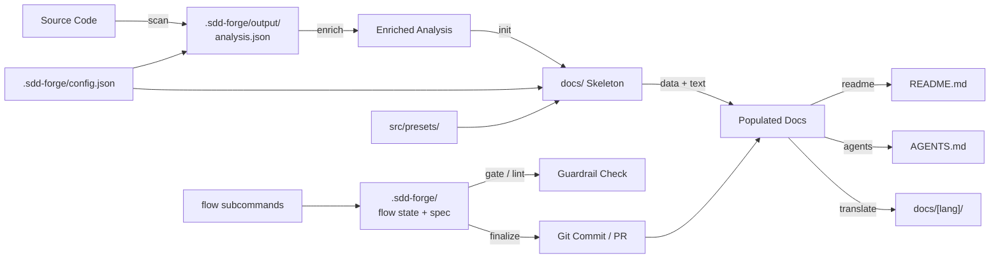

<!-- {{data("base.docs.langSwitcher", {labels: "relative"})}} -->
[日本語](ja/overview.md) | **English**
<!-- {{/data}} -->

# Tool Overview and Architecture

## Description

<!-- {{text({prompt: "Write a 1-2 sentence overview of this chapter. Include the tool's purpose, the problem it solves, and its primary use cases."})}} -->

This chapter provides a concise introduction to sdd-forge — a CLI tool that generates structured technical documentation from source code analysis and supports a Spec-Driven Development workflow. It describes the problem the tool addresses, its architectural design from entry point to subcommands, the key terminology required to work with it, and the sequence of steps to obtain your first documentation output.
<!-- {{/text}} -->

## Content

### Purpose

<!-- {{text({prompt: "Describe the problem this CLI tool solves and its target users. Derive the purpose from package.json and README."})}} -->

Engineering teams routinely face the challenge of maintaining technical documentation that accurately reflects a codebase as it evolves. sdd-forge solves this by driving documentation generation directly from source code analysis, replacing manual authoring with a structured, repeatable pipeline of composable subcommands. The tool is designed for developers and engineering teams who work on Node.js-based projects and want to produce accurate, version-controlled documentation without introducing external runtime dependencies. Because sdd-forge relies solely on Node.js built-in modules, it integrates cleanly into any project that meets the Node.js ≥ 18.0.0 requirement with no additional installation overhead.
<!-- {{/text}} -->

### Architecture Overview

<!-- {{text({prompt: "Generate a mermaid flowchart showing the tool's overall architecture. Include the dispatch structure from entry point to subcommands and the main processing flow (input → processing → output). Output only the mermaid code block.", mode: "deep"})}} -->


<!-- {{/text}} -->

### Key Concepts

<!-- {{text({prompt: "Explain the key concepts and terminology needed to understand this tool in table format. Extract the main concepts from source code."})}} -->

| Concept | Description |
|---|---|
| **Spec-Driven Development (SDD)** | A workflow methodology where a written specification (spec) is produced and gate-checked before implementation begins. sdd-forge provides the `flow` subcommand set to manage this lifecycle. |
| **Docs Pipeline** | The ordered sequence of `docs` subcommands — `scan → enrich → init → data → text → readme → agents → [translate]` — that transforms raw source files into finished markdown documentation. |
| **Preset** | A named, inheritable template configuration stored under `src/presets/` that defines the documentation structure for a specific technology or project type (e.g., `hono`, `nextjs`, `laravel`). Presets use parent-chain inheritance. |
| **Directive** | A special marker embedded in a docs template. `{{data}}` injects structured data generated from source analysis; `{{text}}` injects AI-generated prose. Content inside a directive is overwritten on each build; content outside is preserved. |
| **analysis.json** | The intermediate artifact produced by `docs scan`, stored at `.sdd-forge/output/analysis.json`. It captures the structured representation of the source codebase used by all subsequent pipeline stages. |
| **Flow State** | Per-project metadata tracked by the `flow` subcommands, including the current workflow step, spec content, requirements, and metrics. Stored under `.sdd-forge/`. |
| **Guardrail** | A set of compliance rules, loaded from `.sdd-forge/guardrail.md`, that are checked by `flow run gate` and `flow run lint` at defined phases of the SDD workflow. |
| **Config** | The project-specific configuration file at `.sdd-forge/config.json`, which declares the project language, type, preset, agent settings, and docs output options. |
<!-- {{/text}} -->

### Typical Usage Flow

<!-- {{text({prompt: "Describe the typical steps from installation to first output in step format. Derive the steps from help output and command definitions in the source code."})}} -->

**1. Install the package**

Install sdd-forge globally via npm or pnpm:
```
npm install -g sdd-forge
```

**2. Initialize the project**

Run the setup command in your project root. This creates the `.sdd-forge/` directory and generates the initial `config.json`:
```
sdd-forge setup
```

**3. Scan the source code**

Analyze the project's source files and produce `analysis.json`:
```
sdd-forge docs scan
```

**4. Enrich the analysis**

Enhance the raw scan output with AI-generated summaries for each file:
```
sdd-forge docs enrich
```

**5. Initialize the docs skeleton**

Create the `docs/` directory structure from the configured preset:
```
sdd-forge docs init
```

**6. Populate data and text sections**

Fill `{{data}}` directives with structured content and `{{text}}` directives with generated prose:
```
sdd-forge docs data
sdd-forge docs text
```

**7. Generate README and agent context**

Produce the project README and the `AGENTS.md` context file:
```
sdd-forge docs readme
sdd-forge docs agents
```

After these steps, the `docs/` directory contains the complete generated documentation in the configured output language.
<!-- {{/text}} -->

# System Overview

<!-- {{data("monorepo.monorepo.apps", {labels: "overview", ignoreError: true})}} -->
<!-- {{/data}} -->

<!-- {{text({prompt: "Write a 1-2 sentence overview of this project."})}} -->

sdd-forge is a Node.js CLI package that automates technical documentation generation through a source code analysis pipeline and provides a Spec-Driven Development workflow for managing feature implementation. It is published on npm as `sdd-forge` (version 0.1.0-alpha.650) and operates with no external runtime dependencies.
<!-- {{/text}} -->


## Description

<!-- {{text({prompt: "Write a 1-2 sentence overview of this chapter. Include the project's architecture and whether it integrates with external systems."})}} -->

This chapter provides a system-level view of sdd-forge's internal component architecture and the data flow between its major processing stages. The tool is self-contained with no external runtime dependencies, though it integrates with AI agent providers for text generation and optionally with the GitHub CLI for workflow finalization.
<!-- {{/text}} -->

## Content
### Architecture Diagram

<!-- {{text({prompt: "Generate a mermaid flowchart showing the project architecture. Include data flows between major components. Output only the mermaid code block."})}} -->


<!-- {{/text}} -->
### Component Responsibilities

<!-- {{text({prompt: "Describe the major components with their location, responsibilities, and I/O in table format.", mode: "deep"})}} -->

| Component | Location | Responsibility | Input / Output |
|---|---|---|---|
| CLI Entry Point | `src/sdd-forge.js` | Parses the top-level command, loads project config, initializes the logger, and routes to the appropriate dispatcher or standalone handler | CLI arguments → dispatched module call |
| Docs Dispatcher | `src/docs.js`, `src/docs/commands/` | Implements the 11-stage documentation pipeline: `scan`, `enrich`, `init`, `data`, `text`, `readme`, `agents`, `translate`, `review`, `changelog`, `forge` | Source files / `analysis.json` → `docs/` markdown |
| Flow Dispatcher | `src/flow.js`, `src/flow/lib/` | Implements the SDD workflow through `flow get`, `flow set`, and `flow run` actions covering preparation, gate checks, linting, review, finalization, sync, retro, and reporting | Flow state files / spec → updated state / commits / reports |
| Check Dispatcher | `src/check.js`, `src/check/commands/` | Validates project configuration correctness, documentation freshness, and scan output integrity | `.sdd-forge/` config and `analysis.json` → validation results |
| Presets | `src/presets/` | Provides 38 named, technology-specific documentation templates with parent-chain inheritance (e.g., `hono`, `nextjs`, `laravel`, `monorepo`) | Preset type string → resolved template and chapter configuration |
| Templates | `src/templates/` | Holds the base document structure files consumed by `docs init` to scaffold the `docs/` directory | Template files → initialized `docs/` skeleton with directives |
| Flow Registry | `src/flow/registry.js` | Single source of truth for all flow subcommand metadata: argument definitions, help text, and command handlers | Static definitions → dispatched action |
| Shared Utilities | `src/lib/` | Cross-cutting helpers including config loading, git operations, logging, i18n, CLI argument parsing, progress tracking, preset resolution, and guardrail evaluation | Various inputs → utility functions and shared objects |
| Project Config | `.sdd-forge/config.json` | Stores project-specific runtime settings: language, project type, preset selection, agent provider config, and docs output options | JSON file → configuration object consumed at startup |
<!-- {{/text}} -->
### External Integrations

<!-- {{text({prompt: "If there are external system integrations, describe their purpose and connection method in table format."})}} -->

| Integration | Purpose | Connection Method |
|---|---|---|
| **AI Agent Provider** | Generates AI-authored prose for `{{text}}` directives during `docs enrich` and `docs text` stages | Configured via `agent.default` and `agent.providers` keys in `.sdd-forge/config.json`; the agent module in `src/lib/` invokes the provider at runtime |
| **GitHub CLI (`gh`)** | Creates pull requests, merges branches, and checks repository state during `flow run finalize` | Detected at runtime via the `check` action in the flow registry; used only when `gh` is available in the system PATH and the project config enables it |
<!-- {{/text}} -->
### Environment Differences

<!-- {{text({prompt: "Describe the configuration differences across environments (local/staging/production)."})}} -->

sdd-forge does not define separate environment profiles (local/staging/production) in its configuration schema. All runtime behavior is driven by a single `.sdd-forge/config.json` file located in the project root. Differences across environments are managed by maintaining separate configuration files or by overriding values through `.sdd-forge/overrides.json`. The `cfg.logs.enabled` key controls log output verbosity and is the recommended way to adjust diagnostic detail between developer workstations and CI environments. The AI agent provider settings under `agent.providers` may also differ per environment depending on which agent binary or API endpoint is available.
<!-- {{/text}} -->

---

<!-- {{data("base.docs.nav")}} -->
[Technology Stack and Operations →](stack_and_ops.md)
<!-- {{/data}} -->
