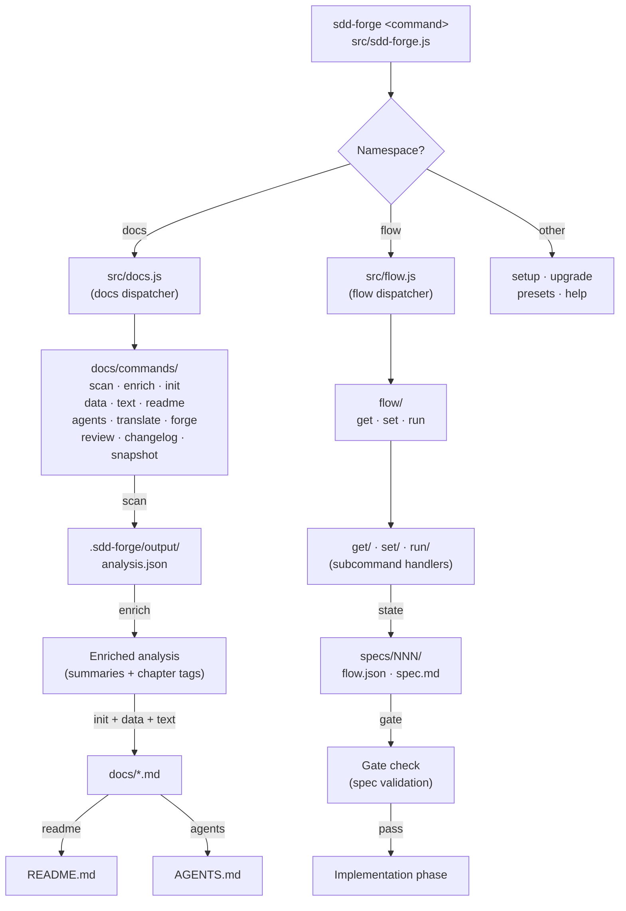

<!-- {{data("base.docs.langSwitcher", {labels: "relative"})}} -->
**English** | [日本語](ja/overview.md)
<!-- {{/data}} -->

# Tool Overview and Architecture

## Description

<!-- {{text({prompt: "Write a 1-2 sentence overview of this chapter. Include the tool's purpose, the problem it solves, and its primary use cases."})}} -->

sdd-forge is a CLI tool that automates technical documentation generation through static source code analysis and orchestrates a Spec-Driven Development (SDD) workflow for AI-assisted projects. It addresses documentation drift and unstructured AI coding sessions by keeping docs synchronized with the codebase and enforcing a gate-checked specification process before any implementation begins.
<!-- {{/text}} -->

## Content

### Purpose

<!-- {{text({prompt: "Describe the problem this CLI tool solves and its target users. Derive the purpose from package.json and README."})}} -->

Development teams working with AI coding agents face two persistent problems: documentation that falls out of sync with source code, and AI sessions that drift away from agreed requirements. sdd-forge solves both by combining static source analysis with a deterministic flow engine.

On the documentation side, sdd-forge scans the project's source code, enriches the extracted data with AI-generated summaries, and renders structured markdown files from preset-based templates. Because generation is driven by the actual source, the output reflects the real state of the codebase rather than a manually maintained description.

On the workflow side, sdd-forge implements Spec-Driven Development: a feature request is captured in a machine-readable spec, validated through an automated gate check, and only then handed off to an AI agent for implementation. The flow state persists across context windows, so progress is never lost when a session restarts.

The primary target users are:
- AI coding agents (such as Claude Code) that need a reliable, repeatable development loop
- Development teams onboarding to an existing codebase who need documentation generated quickly from source
- Projects that require auditable, always-current technical docs without manual maintenance overhead
<!-- {{/text}} -->

### Architecture Overview

<!-- {{text({prompt: "Generate a mermaid flowchart showing the tool's overall architecture. Include the dispatch structure from entry point to subcommands and the main processing flow (input → processing → output). Output only the mermaid code block.", mode: "deep"})}} -->


<!-- {{/text}} -->

### Key Concepts

<!-- {{text({prompt: "Explain the key concepts and terminology needed to understand this tool in table format. Extract the main concepts from source code."})}} -->

| Term | Description |
|---|---|
| **Preset** | A framework- or technology-specific configuration package under `src/presets/`. Each preset contains scan parsers, DataSource classes, and markdown templates. Presets form an inheritance chain via a `parent` field (e.g., `base → cli → node-cli`). |
| **Directive** | A comment-delimited marker inside a template file that instructs the build pipeline to inject content. The two output directives are `{{data(...)}}` and `{{text(...)}}`. |
| **`{{data(...)}}`** | A directive that injects structured data generated by a DataSource method. Typically renders as a markdown table populated from `analysis.json`. |
| **`{{text(...)}}`** | A directive that injects AI-generated prose. Accepts a `prompt` parameter and an optional `mode: "deep"` for source-level detail. Content between the opening and closing tags is replaced on each build. |
| **analysis.json** | The artifact produced by `sdd-forge docs scan`. Contains statically extracted source code metadata: file paths, class names, methods, line counts, and modification times, organized by analysis category. |
| **Enrich** | The `docs enrich` step where an AI agent annotates each entry in `analysis.json` with a role summary, chapter assignment, and description, providing richer context for subsequent text generation. |
| **Spec** | A structured specification document (`spec.md`) created during the planning phase of an SDD flow. It captures requirements, design decisions, and a test plan. The spec must pass a gate check before implementation is permitted. |
| **Flow** | The SDD workflow state machine persisted in `specs/NNN/flow.json`. It tracks the current step, requirements status, branch information, and phase (plan → impl → finalize → sync) across context windows. |
| **Gate** | An automated validation step (`flow run gate`) that checks whether the spec meets quality criteria before the implementation phase is unlocked. |
| **Config** | The project-level configuration file at `.sdd-forge/config.json`, generated by `sdd-forge setup`. Defines the preset type, output language, and AI agent settings. |
<!-- {{/text}} -->

### Typical Usage Flow

<!-- {{text({prompt: "Describe the typical steps from installation to first output in step format. Derive the steps from help output and command definitions in the source code."})}} -->

**1. Install the package globally**

```bash
npm install -g sdd-forge
```

**2. Run the setup wizard in your project root**

```bash
sdd-forge setup
```

The wizard prompts for the project type (preset), output language, and AI agent credentials. It creates `.sdd-forge/config.json` and generates an initial `AGENTS.md`.

**3. Scan the source code**

```bash
sdd-forge docs scan
```

Extracts structural metadata from the source tree and writes `.sdd-forge/output/analysis.json`.

**4. Build the full documentation suite**

```bash
sdd-forge docs build
```

Runs the complete pipeline: scan → enrich → init → data → text → readme → agents. On completion, `docs/` contains the generated chapter files and `README.md` is updated.

**5. Review the output**

Open `docs/overview.md` or any chapter file to read the generated documentation. Run `sdd-forge docs review` to get an AI quality assessment of the generated content.

**6. (Optional) Start a Spec-Driven Development flow for a new feature**

Use the `/sdd-forge.flow-plan` skill in Claude Code, or run:

```bash
sdd-forge flow prepare
```

This creates a spec branch, guides you through writing `spec.md`, and runs the gate check before implementation begins.
<!-- {{/text}} -->

---

<!-- {{data("base.docs.nav")}} -->
[Technology Stack and Operations →](stack_and_ops.md)
<!-- {{/data}} -->
