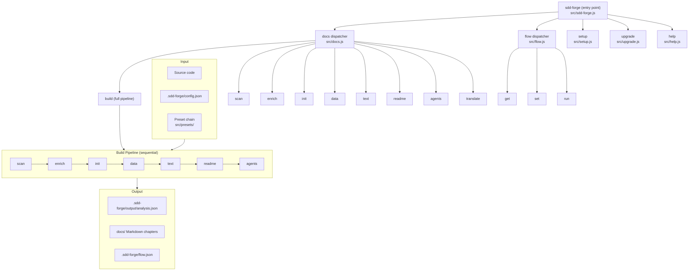

<!-- {{data("base.docs.langSwitcher", {labels: "relative"})}} -->
**English** | [日本語](ja/overview.md)
<!-- {{/data}} -->

# Tool Overview and Architecture

## Description

<!-- {{text({prompt: "Write a 1-2 sentence overview of this chapter. Include the tool's purpose, the problem it solves, and its primary use cases."})}} -->

This chapter introduces sdd-forge, a CLI tool that automates technical documentation generation from source code analysis and orchestrates a Spec-Driven Development (SDD) workflow. It covers the tool's core purpose, the problem it addresses, the overall system architecture, and the steps required to go from installation to first output.
<!-- {{/text}} -->

## Content

### Purpose

<!-- {{text({prompt: "Describe the problem this CLI tool solves and its target users. Derive the purpose from package.json and README."})}} -->

Maintaining accurate technical documentation alongside a fast-moving codebase is a persistent challenge for software teams. Documentation written by hand quickly drifts from the actual source, while the effort required to keep it current competes directly with feature development time.

sdd-forge solves this by statically analyzing source files to extract structure — classes, methods, configuration, and dependencies — and injecting that data into Markdown templates through deterministic `{{data}}` directives. Prose sections that require judgment are delegated to an AI agent through `{{text}}` directives, keeping human-readable explanations in sync without manual effort.

Beyond documentation, sdd-forge provides a structured SDD workflow that moves a feature from initial specification through implementation to merged code, with programmatic gate checks at each phase transition. This workflow is designed to work with AI coding agents, keeping them within well-defined boundaries while automating the repetitive orchestration tasks.

The primary target users are development teams and individual engineers who use AI coding assistants and want a repeatable, auditable process for producing and maintaining technical documentation across projects of varying languages and frameworks.
<!-- {{/text}} -->

### Architecture Overview

<!-- {{text({prompt: "Generate a mermaid flowchart showing the tool's overall architecture. Include the dispatch structure from entry point to subcommands and the main processing flow (input → processing → output). Output only the mermaid code block.", mode: "deep"})}} -->


<!-- {{/text}} -->

### Key Concepts

<!-- {{text({prompt: "Explain the key concepts and terminology needed to understand this tool in table format. Extract the main concepts from source code."})}} -->

| Concept | Description |
|---|---|
| **Preset** | A framework-specific collection of scan parsers, DataSource classes, and Markdown templates. Presets form an inheritance chain (e.g., `base → cli → node-cli`) so child presets override only what differs from their parent. |
| **DataSource** | A class that provides structured data to a template. Scannable DataSources collect information directly from source files; data-only DataSources format or aggregate already-collected data. |
| **Scan Parser** | A module that statically analyzes source files for a specific language or framework and extracts structured information such as classes, methods, routes, and configuration. |
| **`{{data}}` directive** | A template marker populated by machine-collected, deterministic data from the scan output. Its content is always overwritten on each build. |
| **`{{text}}` directive** | A template marker populated by AI-generated prose. Used for descriptions and explanations that static analysis alone cannot produce. |
| **SDD Flow** | A three-phase development workflow — Plan (spec → gate → test), Implement (code → review), Merge (docs → commit → merge) — tracked in `.sdd-forge/flow.json`. |
| **Spec Gate** | A programmatic check that validates all requirements are resolved and approvals are recorded before the implementation phase begins. |
| **Flow State** | The file `.sdd-forge/flow.json` that persists the current SDD workflow phase, step progress, requirement list, and metrics across sessions. |
| **Build Pipeline** | The ordered sequence of `docs` subcommands — `scan → enrich → init → data → text → readme → agents` — that produces a complete documentation set from source code. |
| **Enrich** | A pipeline step in which an AI agent processes the raw scan output and annotates each entry with role descriptions, summaries, and chapter classifications. |
| **Language Handler** | A per-language factory module (JavaScript, PHP, Python, YAML, etc.) that provides parse, minify, import extraction, and export extraction operations used by scan parsers. |
| **Config Context** | The project-level file `.sdd-forge/config.json`, generated by `sdd-forge setup`, that controls preset selection, output language, AI agent settings, and chapter ordering. |
<!-- {{/text}} -->

### Typical Usage Flow

<!-- {{text({prompt: "Describe the typical steps from installation to first output in step format. Derive the steps from help output and command definitions in the source code."})}} -->

**1. Install the package globally**

```bash
npm install -g sdd-forge
```

Node.js 18 or later is required. sdd-forge has no external runtime dependencies beyond the Node.js built-in modules.

**2. Run setup inside your project**

```bash
cd your-project
sdd-forge setup
```

Setup guides you through selecting a preset that matches your project's framework, choosing an output language, and configuring an AI agent. It writes `.sdd-forge/config.json` and creates the initial `docs/` directory from the preset's templates.

**3. Run the full documentation build**

```bash
sdd-forge docs build
```

This executes the complete pipeline in sequence: `scan` (static analysis of source files), `enrich` (AI metadata annotation), `init` (template initialization), `data` (populate `{{data}}` directives), `text` (populate `{{text}}` directives with AI-generated prose), `readme` (generate `README.md`), and `agents` (generate `AGENTS.md`).

**4. Review the generated output**

Markdown chapter files are written to `docs/`. Review them to confirm the content reflects your codebase accurately. Directives outside `{{data}}` and `{{text}}` blocks are preserved and will not be overwritten on subsequent builds.

**5. Explore individual commands**

```bash
sdd-forge help
```

Each pipeline step (`scan`, `enrich`, `data`, `text`, etc.) can be run independently, making it straightforward to regenerate only the sections that have changed after a code update.
<!-- {{/text}} -->

---

<!-- {{data("base.docs.nav")}} -->
[Technology Stack and Operations →](stack_and_ops.md)
<!-- {{/data}} -->
