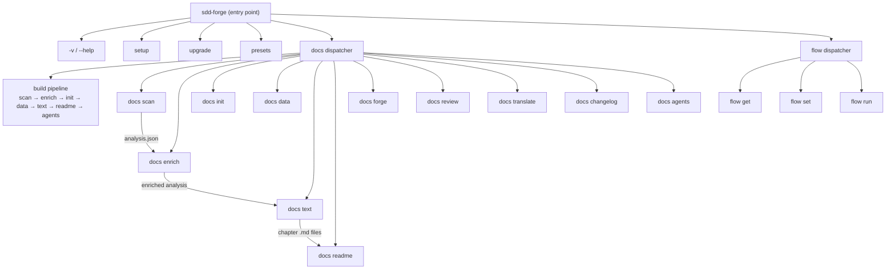

<!-- {{data("base.docs.langSwitcher", {labels: "relative"})}} -->
**English** | [日本語](ja/overview.md)
<!-- {{/data}} -->

# Tool Overview and Architecture

## Description

<!-- {{text({prompt: "Write a 1-2 sentence overview of this chapter. Include the tool's purpose, the problem it solves, and its primary use cases."})}} -->

`sdd-forge` is a CLI tool that automates documentation generation from source code and manages the full Spec-Driven Development (SDD) lifecycle — from specification through implementation to merge. It is designed to work alongside AI coding agents, keeping project documentation in sync with the codebase without manual effort.
<!-- {{/text}} -->

## Content

### Purpose

<!-- {{text({prompt: "Describe the problem this CLI tool solves and its target users. Derive the purpose from package.json and README."})}} -->

Software projects frequently suffer from documentation that lags behind the code, inconsistent specification practices, and fragmented AI-assisted workflows. `sdd-forge` addresses these problems by statically analyzing source code to produce structured documentation and by providing a disciplined three-phase development flow (plan → implement → merge) that integrates directly with AI agents such as Claude Code.

The tool is aimed at developers and teams who use AI coding assistants and want reliable, auto-generated documentation alongside a repeatable spec-first workflow. It is distributed as a zero-external-dependency Node.js CLI package, making it straightforward to add to any JavaScript or TypeScript project.
<!-- {{/text}} -->

### Architecture Overview

<!-- {{text({prompt: "Generate a mermaid flowchart showing the tool's overall architecture. Include the dispatch structure from entry point to subcommands and the main processing flow (input → processing → output). Output only the mermaid code block.", mode: "deep"})}} -->


<!-- {{/text}} -->

### Key Concepts

<!-- {{text({prompt: "Explain the key concepts and terminology needed to understand this tool in table format. Extract the main concepts from source code."})}} -->

| Concept | Description |
|---|---|
| **Preset** | A configuration template (in `src/presets/`) that defines document structure, chapter order, and data sources for a given project type (e.g., `node-cli`, `js-webapp`). Presets support inheritance via a `parent` chain. |
| **Directive** | A marker embedded in documentation source files. `{{data(...)}}` injects structured data; `{{text(...)}}` marks a section to be written by AI. Content inside directives is overwritten on each build; content outside is preserved. |
| **Scan** | Static analysis of the source tree that produces `analysis.json` in `.sdd-forge/output/`. This is the raw input for all subsequent documentation steps. |
| **Enrich** | An AI-powered post-processing step that adds role, summary, and chapter classification to each entry in the raw analysis, producing an enriched analysis used by the `text` command. |
| **Chapter** | A single markdown file representing one section of the generated documentation. Chapter order is defined by the `chapters` array in `preset.json` and can be overridden per project in `config.json`. |
| **SDD Flow** | The three-phase Spec-Driven Development workflow: **plan** (draft requirements, write spec, validate gate, write tests), **implement** (write code, run AI review), and **merge** (update docs, commit, merge branch). |
| **flow.json** | A state file in `.sdd-forge/` that tracks the current SDD flow step, branch, and status. Only one flow can be active per working tree at a time. |
| **`docs build`** | The full documentation pipeline command that orchestrates all steps sequentially: scan → enrich → init → data → text → readme → agents (→ translate if multi-language is configured). |
<!-- {{/text}} -->

### Typical Usage Flow

<!-- {{text({prompt: "Describe the typical steps from installation to first output in step format. Derive the steps from help output and command definitions in the source code."})}} -->

**1. Install the package globally**

```bash
npm install -g sdd-forge
```

**2. Initialize your project**

Run the interactive setup in your project root. This creates `.sdd-forge/config.json` and an `AGENTS.md` context file, and registers the SDD flow skills for your AI agent:

```bash
sdd-forge setup
```

**3. Scan the source code**

Analyze the project tree. Results are saved to `.sdd-forge/output/analysis.json`:

```bash
sdd-forge docs scan
```

**4. Build documentation**

Run the full pipeline — enrich, initialize chapter files, generate text, and assemble the final markdown:

```bash
sdd-forge docs build
```

**5. View the output**

Generated documentation appears in the `docs/` directory (or the path configured in `config.json`). Each chapter is a standalone markdown file whose structure is defined by the active preset.

**6. Keep docs in sync**

After subsequent code changes, re-run `sdd-forge docs build` (or use `--regenerate` to skip re-initializing chapter files). Within an SDD flow, the merge phase runs this automatically.
<!-- {{/text}} -->

---

<!-- {{data("base.docs.nav")}} -->
[Technology Stack and Operations →](stack_and_ops.md)
<!-- {{/data}} -->
