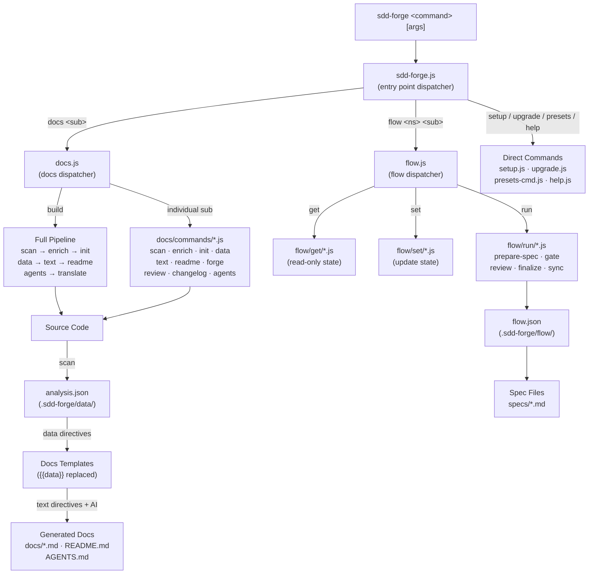

<!-- {{data("base.docs.langSwitcher", {labels: "relative"})}} -->
**English** | [日本語](ja/overview.md)
<!-- {{/data}} -->

# Tool Overview and Architecture

## Description

<!-- {{text({prompt: "Write a 1-2 sentence overview of this chapter. Include the tool's purpose, the problem it solves, and its primary use cases."})}} -->

This chapter introduces sdd-forge — a CLI tool that automates documentation generation from source code analysis and provides a structured Spec-Driven Development workflow for AI-assisted software projects. It covers the tool's purpose, dispatch architecture, and core concepts to orient new users before they explore individual commands.
<!-- {{/text}} -->

## Content

### Purpose

<!-- {{text({prompt: "Describe the problem this CLI tool solves and its target users. Derive the purpose from package.json and README."})}} -->

Development teams working with AI coding agents face a recurring challenge: documentation drifts out of sync with the codebase, and AI agents lack the structured context they need to work reliably. sdd-forge addresses this by automating the full documentation pipeline — scanning source code, enriching it with AI-generated metadata, and filling templated markdown chapters with accurate, up-to-date prose.

Beyond documentation, sdd-forge provides a Spec-Driven Development (SDD) workflow that enforces a plan → implement → merge cycle. Every feature request must pass through a specification phase and a gate check before a single line of production code is written, giving AI agents clear guardrails and making the intent behind each change traceable.

The primary target users are:

- **Development teams using Claude Code or other AI coding agents** who need reliable, always-current project context in AGENTS.md or CLAUDE.md.
- **Individual developers** who want to maintain living documentation without writing it manually.
- **Teams adopting spec-driven practices** who want a lightweight CLI to enforce specification and review gates in their existing git workflow.
<!-- {{/text}} -->

### Architecture Overview

<!-- {{text({prompt: "Generate a mermaid flowchart showing the tool's overall architecture. Include the dispatch structure from entry point to subcommands and the main processing flow (input → processing → output). Output only the mermaid code block.", mode: "deep"})}} -->


<!-- {{/text}} -->

### Key Concepts

<!-- {{text({prompt: "Explain the key concepts and terminology needed to understand this tool in table format. Extract the main concepts from source code."})}} -->

| Concept | Description |
|---|---|
| **Spec-Driven Development (SDD)** | A three-phase development discipline — plan, implement, merge — that requires a written specification and a gate check to pass before any production code is written. |
| **`{{data}}` directive** | A template placeholder replaced by machine-extracted data (e.g., directory trees, class lists, route tables) drawn from `analysis.json`. Content inside the tags is overwritten on every build. |
| **`{{text}}` directive** | A template placeholder filled by an AI agent with prose narrative. Accepts a `prompt` string and an optional `mode: "deep"` flag for richer source-level analysis. |
| **`analysis.json`** | A structured JSON file generated by `docs scan` that captures the project's file hierarchy, classes, methods, routes, and other language-specific metadata. Stored in `.sdd-forge/data/`. |
| **Preset** | A named project-type template (e.g., `node-cli`, `laravel`, `nextjs`) that bundles scan rules, DataSource classes, and chapter templates. Presets form a single-inheritance chain via a `parent` field. |
| **Chapter** | An individual documentation markdown file (e.g., `overview.md`, `cli_commands.md`) generated from a preset template. Chapter order is defined by the `chapters` array in `preset.json`. |
| **`docs build` pipeline** | The full documentation generation sequence: `scan → enrich → init → data → text → readme → agents → translate`. Each step can also be run individually. |
| **Enrich** | An AI-assisted step that annotates each entry in `analysis.json` with role summaries and chapter classifications before the text-generation phase. |
| **Gate** | A validation step in the SDD flow that checks whether a specification meets all required criteria before implementation is allowed to proceed. |
| **AGENTS.md / CLAUDE.md** | A generated context file that gives AI coding agents a current snapshot of the project's architecture, commands, and constraints. `CLAUDE.md` is a symlink to `AGENTS.md`. |
<!-- {{/text}} -->

### Typical Usage Flow

<!-- {{text({prompt: "Describe the typical steps from installation to first output in step format. Derive the steps from help output and command definitions in the source code."})}} -->

**Step 1 — Install the package globally**

```bash
npm install -g sdd-forge
```

**Step 2 — Register your project**

Run the interactive setup wizard from your project root. It prompts for the project name, source root, project type (preset), output languages, and AI agent credentials, then writes `.sdd-forge/config.json`.

```bash
sdd-forge setup
```

**Step 3 — Generate documentation in one command**

The `build` command runs the full pipeline — scanning source code, enriching with AI metadata, initialising chapter templates, replacing `{{data}}` directives, filling `{{text}}` directives with AI-generated prose, and producing `README.md` and `AGENTS.md`.

```bash
sdd-forge docs build
```

After this step, a `docs/` directory containing all chapter files and an updated `README.md` are available in the project root.

**Step 4 (optional) — Rebuild after code changes**

Re-run `docs build` at any time to keep documentation in sync with source changes. Individual pipeline steps such as `scan`, `text`, or `readme` can also be run in isolation when only a subset of content needs refreshing.

**Step 5 (optional) — Adopt the SDD workflow for new features**

To develop new features under the spec-driven discipline, start the planning phase with the `flow-plan` skill in Claude Code, or invoke the CLI directly:

```bash
sdd-forge flow run prepare-spec
```

This creates a branch, initialises a spec file, and guides the work through gate → implement → review → merge.
<!-- {{/text}} -->

---

<!-- {{data("base.docs.nav")}} -->
[Technology Stack and Operations →](stack_and_ops.md)
<!-- {{/data}} -->
