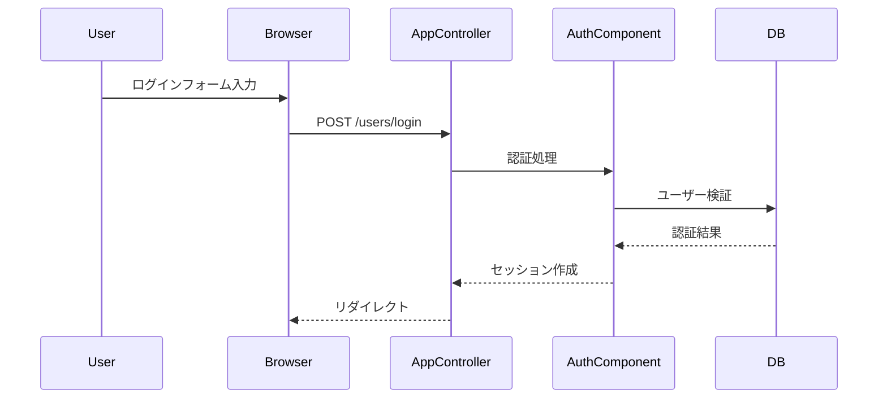

# 05. 認証とセッション管理

## 説明

<!-- @text-fill: この章の概要を1〜2文で記述してください。認証コンポーネント、ACL ロール数、セッション管理方式を踏まえること。 -->

## 内容

### 認証方式

CakePHP の AuthComponent を使用したフォーム認証。

### ACL（アクセス制御リスト）

### セッション管理

CakePHP 標準のセッション管理を使用。

### AppController 認証設定

<!-- @text-fill: 認証方式の概要を説明してください。フレームワークの認証コンポーネント設定を含めること。 -->

<!-- @data-fill: kv(config.auth, labels=項目|設定値) -->

### ACL 権限マトリクス

<!-- @text-fill: ACL 定義ファイルの役割と、ロールベースのアクセス制御ルールを説明してください。 -->

<!-- @data-fill: table(config.acl, labels=ロール|group_id|権限) -->

### ログインフロー

