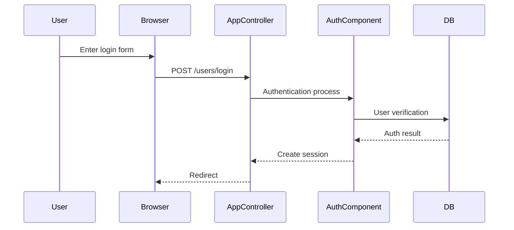

<!--  -->

<!--  -->
### Login Flow

```mermaid
sequenceDiagram
  participant User
  participant Browser
  participant AppController
  participant AuthComponent
  participant DB

  User->>Browser: Enter login form
  Browser->>AppController: POST /users/login
  AppController->>AuthComponent: Authentication process
  AuthComponent->>DB: User verification
  DB-->>AuthComponent: Auth result
  AuthComponent-->>AppController: Create session
  AppController-->>Browser: Redirect
```
<!--  -->
