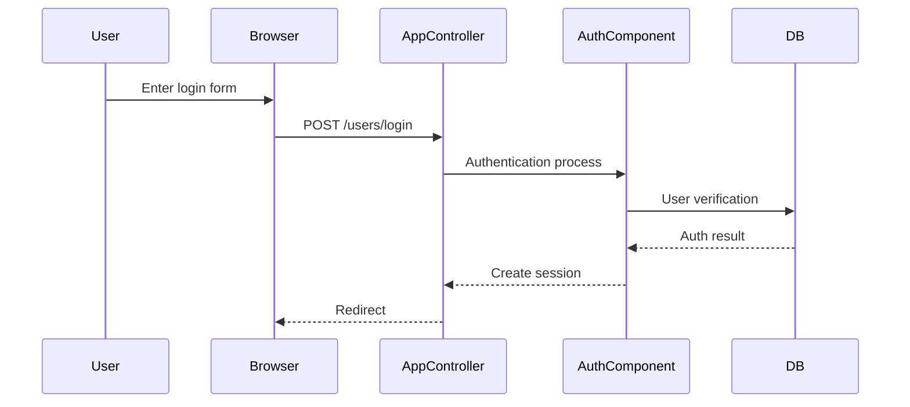

<!--  -->

<!--  -->
### Authentication Method

<!-- {{text({prompt: "Describe the authentication method overview. Include authentication component configuration.", mode: "deep"})}} -->
<!-- {{/text}} -->

<!-- {{data("cakephp2.config.auth", {labels: "Item|Value"})}} -->
<!-- {{/data}} -->
<!--  -->

<!--  -->
### ACL (Access Control)

<!-- {{text({prompt: "Describe the access control definitions and role-based access control rules.", mode: "deep"})}} -->
<!-- {{/text}} -->

<!-- {{data("cakephp2.config.acl", {labels: "Role|group_id|Permissions"})}} -->
<!-- {{/data}} -->
<!--  -->

<!--  -->
### Login Flow

<!--  -->
