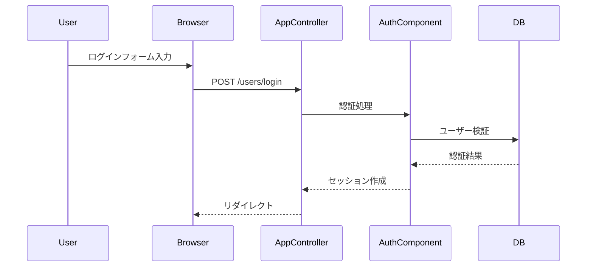

<!--  -->

<!--  -->
### ログインフロー

```mermaid
sequenceDiagram
  participant User
  participant Browser
  participant AppController
  participant AuthComponent
  participant DB

  User->>Browser: ログインフォーム入力
  Browser->>AppController: POST /users/login
  AppController->>AuthComponent: 認証処理
  AuthComponent->>DB: ユーザー検証
  DB-->>AuthComponent: 認証結果
  AuthComponent-->>AppController: セッション作成
  AppController-->>Browser: リダイレクト
```
<!--  -->
