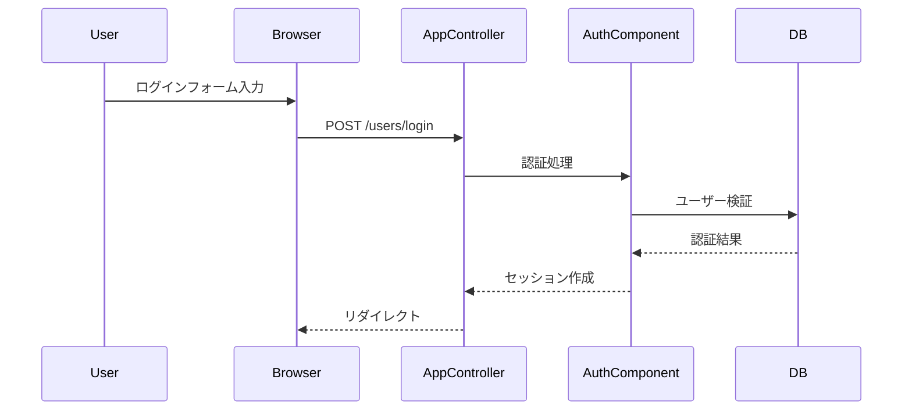

<!--  -->

<!--  -->
### 認証方式

<!-- {{text({prompt: "認証方式の概要を説明してください。認証コンポーネント設定を含めること。", mode: "deep"})}} -->
<!-- {{/text}} -->

<!-- {{data("cakephp2.config.auth", {labels: "項目|設定値"})}} -->
<!-- {{/data}} -->
<!--  -->

<!--  -->
### ACL（アクセス制御）

<!-- {{text({prompt: "アクセス制御の定義と、ロールベースのアクセス制御ルールを説明してください。", mode: "deep"})}} -->
<!-- {{/text}} -->

<!-- {{data("cakephp2.config.acl", {labels: "ロール|group_id|権限"})}} -->
<!-- {{/data}} -->
<!--  -->

<!--  -->
### ログインフロー

<!--  -->
